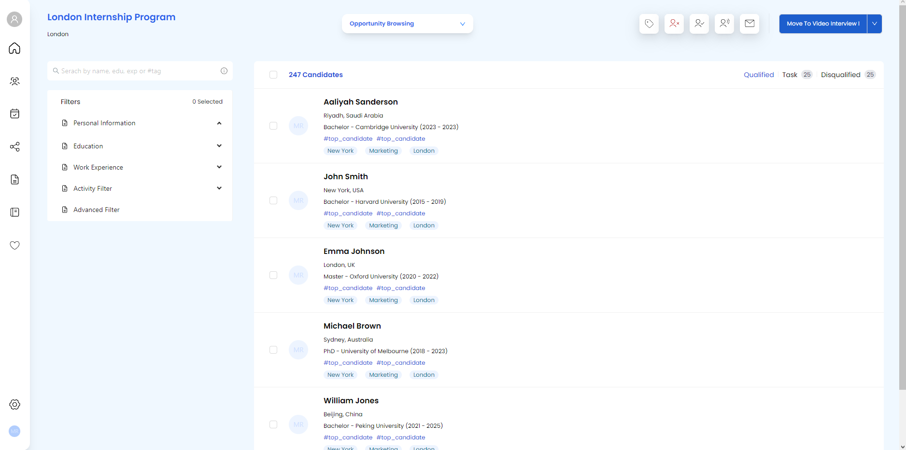

# Application view

This is a view application designed for recruiters or HR professionals. It allows them to view their candidates and categorize them. 
**The key feature of this application is its ability to design a modern UI, which is created using Figma and implemented with React and Ant Design and deployed on vercel.**

# Preview

## Table of Contents
- [Getting Started](#getting-started)
- [Installation](#installation)
- [Contributing](#contributing)

## Getting Started

To get a local copy of the project up and running, follow these steps.

### Prerequisites
- [Tailwindcss](https://tailwindcss.com)
- [Node.js](https://nodejs.org)
- [Git](https://git-scm.com)

### Installation

1. Clone the repository:  
`git clone https://github.com/MostafaMahgoub/application-view.git`

2. To install the dependencies for the project run inside the project dir :  
`npm install`

## Testing

To run the test suite for the client side, navigate to the `client` folder and run:

`npm test`

This will run the test suite using Jest and Enzyme.

## Contributing

Pull requests are welcome. For major changes, please open an issue first to discuss what you would like to change.
